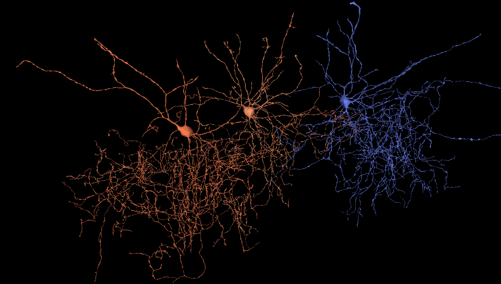

A hands-on introduction to exploring and analyzing the [MICrONS](https://www.microns-explorer.org/) dataset — one cubic millimeter of mouse visual cortex reconstructed from electron microscopy, with ~200,000 cells and ~half a billion synapses. 

::: {.callout-tip}
## Before you start
Work through the [Setup & FAQ](setup.qmd) page first — it covers the one-time Google login / Terms-of-Service step needed to view the data, and the account setup for the coding module.

Each module has fill-in **answer boxes**. Your responses save automatically in your browser as you type. Use the floating **Download all** button (bottom-right) to export everything as a single file to hand in.
:::

## Modules

### Module 1 · Neuroglancer Navigation & Organelles
::::{.grid}
:::{.g-col-6}

 [Open Module 1](module-1.html) 

:::
:::{.g-col-6}
Get oriented in Neuroglancer: the EM, segmentation, and annotation panels; moving through the raw electron-microscopy volume; and the layered organization of visual cortex. 

Then identify subcellular ultrastructure — nuclei, mitochondria, endoplasmic reticulum, myelin, and synapses — and annotate examples directly in the volume.
:::
::::

### Module 2 · Connectivity, Cell Types & Dash Apps
::::{.grid}
:::{.g-col-6}

 [Open Module 2](module-2.html) 

:::
:::{.g-col-6}
Move from single cells to circuits. Classify dendritic spines and synapse locations, distinguish excitatory from inhibitory inputs, then use the MICrONS **Table Viewer** and **Connectivity Viewer** Dash Apps to query neurons by type and connectivity. 

Scientific insight: build a 3D visualization of what makes a Chandelier cell unique from other cells.
:::
::::

### Module 3 · Introduction to Coding
::::{.grid}
:::{.g-col-6}

 [Open Module 3](module-3.html) 

:::
:::{.g-col-6}
Access the same data programmatically with Python and CAVEclient. Load a neuron's morphology, query cell-type tables, and build a cell-type-sorted connectivity matrix — working up to a heatmap of who connects to whom. 

Runs in Google Colab; no local install required.
:::
::::

---

::: {.callout-note appearance="minimal"}
Adapted from the Allen Institute [HIVE *Teaching Connectomics* curriculum](https://alleninstitute.github.io/Teaching_Connectomics/). Supported by the NIH BRAIN Initiative (grant UM1NS132253 CONNECTS, and U24NS120053).

:::
