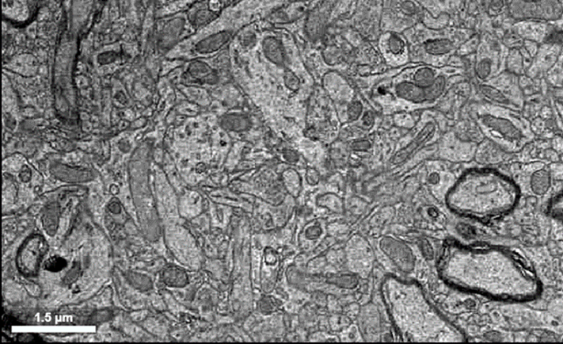{fig-align="center"}

## Overview

In this first module you will get oriented in **Neuroglancer** — the browser tool used to explore the MICrONS reconstruction of mouse visual cortex — and then use it to identify subcellular **organelles and ultrastructure** in the raw electron-microscopy (EM) data. 

The MICrONS volume is one cubic millimeter of cortex, imaged by EM and densely segmented into ~200,000 cells and ~500 million synapses [@the_microns_consortium_functional_2025].

## Learning goals

* Navigate the EM, segmentation, and annotation panels of Neuroglancer, and move through the raw EM volume in 2D and 3D.
* Identify neuronal ultrastructure in EM — nuclei, mitochondria, smooth ER, myelinated axons, and synapses — and relate each to its function.
* Place point annotations on structures you find and share a Neuroglancer state with your instructor.

::: {.callout-tip}
## Before you start
If you have not already, work through the [Setup & FAQ](setup.qmd) page — you need a Google login and a one-time Terms-of-Service acceptance to view the data. Your answers on this page save automatically in your browser; use **Download all** (bottom-right) to export them.
:::

## Part 1.1 · Getting oriented in Neuroglancer

Open the Module 1 scene by clicking the link (or paste it into Chrome or Firefox):

> <https://spelunker.cave-explorer.org/#!gs://microns-static-links/mm3/education/module-2-organelles.json>

You should see three panels:

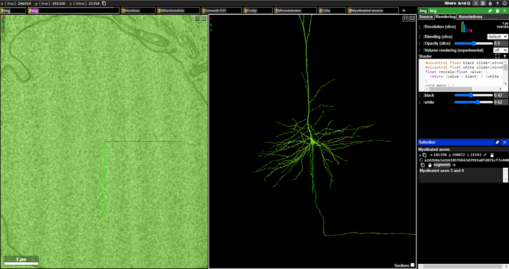{fig-align="center"}

- The **left panel** shows the raw EM images — the imaged sections of the cortical volume. Here you are looking directly into the nucleus of a neuron.
- The **middle panel** shows the 3D segmentation: the reconstructed neuron (a pyramidal cell) whose nucleus you are looking at, with its dendritic arbor and a thin axon leaving the soma.
- The **right panel** holds the settings for whichever layer you select.

::: {.callout-caution collapse="true"}
## If the segmentation does not render
Accept the Terms of Service on your Google account (<https://global.daf-apis.com/sticky_auth/api/v1/tos/2/accept>), hard-refresh, and if a red error persists, ask your instructor. More in the [Setup & FAQ](setup.qmd).
:::

### Layer tabs

The boxes across the top of the EM panel are **layer** tabs. The `img` tab is the raw EM image layer.

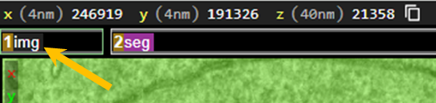{fig-align="center"}

-  a layer tab to open its settings in the right-hand panel.
-  a layer tab to toggle it on/off (a strikethrough means it is off).
- Do **not** click the "x" or trashcan — that removes the layer entirely.

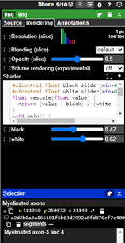{fig-align="right"}

### Moving in the 3D (segmentation) panel

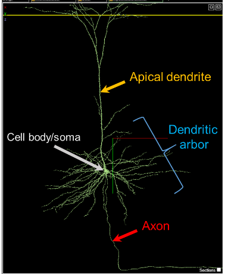{fig-align="center"}

* Jump to a location: 
* Rotate:  + drag
* Pan:  + drag
* Zoom:  + 

### Moving in the 2D (EM) panel

* Pan:  + drag
* Zoom:  + 
* Step through sections in z: , or  / 

::: {.callout-caution}
This data is *anisotropic* — sections are thicker than they are wide. Keep the 2D plane square-on; if it rotates accidentally, hover over the 2D panel and press  to reset. Toggle the section overlay in 3D with .
:::

Take a couple of minutes to rotate, pan, zoom, and step through z until the controls feel natural.

## Part 1.2 · Organelles and ultrastructure in EM

The scene has a pre-made annotation **layer for each structure below**, with three examples already placed. For each: 

1.  the layer tab to reveal it
2.  the same tab to load its annotations into the right-hand panel 
3.  each annotation to jump to it. 

Then find **one more** of your own with the point-annotation tool ( on the EM image), and estimate its size from the scale bar (bottom-left of the EM panel).

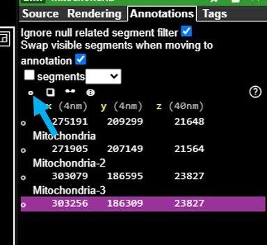{fig-align="right"}

### Nucleus
Houses the DNA and is the site of transcription. The blue arrow marks the interior; the yellow arrow the nuclear membrane. Surrounding axons and dendrites look tiny by comparison.

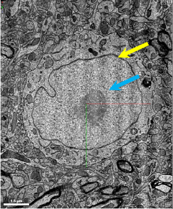{fig-align="center"}

:::{.task}
Find one more nucleus, annotate it, and estimate its diameter (with units) using the scale bar.
:::



### Mitochondria
The cell's ATP factories (blue arrow), often positioned near synapses where energy demand is high.

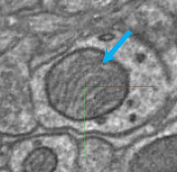{fig-align="center"}

::: {.callout-tip}
Adjust brightness/contrast with the **Shader Control** submenu in the layer's Tool Palette.
:::

:::{.task}
Find one more mitochondrion, annotate it, and estimate its size.
:::



### Smooth endoplasmic reticulum
Tubular, ribosome-free membrane (blue arrow); a site of lipid synthesis and intracellular calcium storage. Usually found in the soma, near the nucleus.

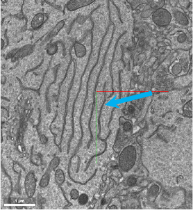{fig-align="center"}

:::{.task}
Find one more example of smooth ER, annotate it, and estimate its width in the plane of section.
:::



### Myelinated axons
Myelin is a fatty, insulating wrap made of oligodendrocyte membranes that speeds conduction. In EM it appears as dark concentric rings around a transected axon (blue arrows).

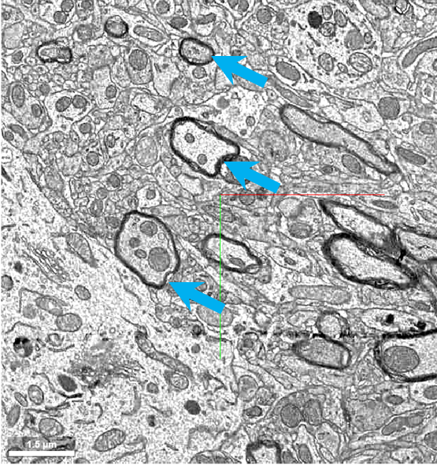{fig-align="center"}

:::{.task}
Find one more myelinated axon, annotate it, and estimate the axon diameter (including the myelin sheath).
:::



### Synapses
Identified by presynaptic **vesicles** (blue arrows) and pre-/post-synaptic **densities** (yellow arrowheads), with a thin synaptic cleft between them.

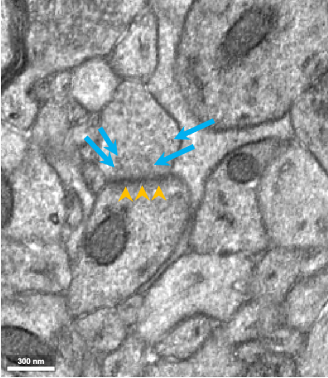{fig-align="center"}

In the 3D panel, synapses often show up as a presynaptic axonal "bulge" meeting a postsynaptic spine "head."  on the EM image to pull the pre- and post-synaptic partners into the 3D panel and rotate to see the contact.

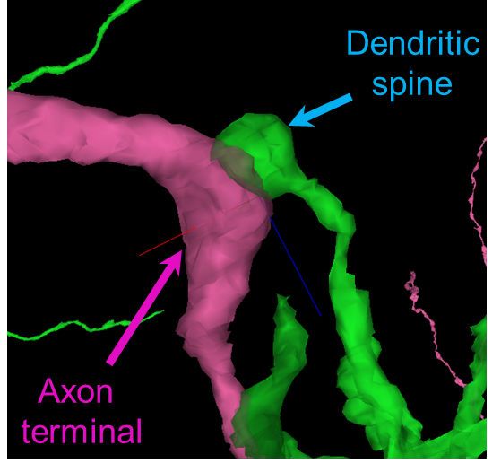{fig-align="center"}

:::{.task}
Find one more synapse, annotate it, and estimate the width of the pre-/post-synaptic contact (the **postsynaptic density**).
:::



:::{.task}
At your synapse, count how many vesicles you see in one section. Do you see more or less as you scroll in *z*.
:::



## Part 1.3 · Share your work

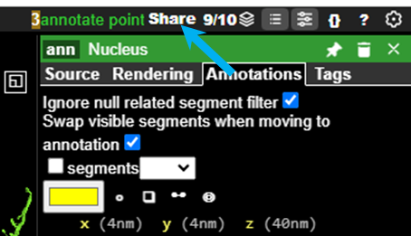{fig-align="right"}

:::{.task}
When you have annotated all five structures, click **Share** (top-right of Neuroglancer) to generate a link that includes all your annotations. Paste it below so your instructor can view them.
:::



## Optional · See the cortical layers

If you would like to see how the cells you have been exploring sit within the layered structure of cortex, open this scene, which shows the Layer 1–6 boundary meshes:

> <https://spelunker.cave-explorer.org/#!gs://microns-static-links/mm3/education/module-1-cortical-layers.json>

## Additional resources

Explore the dataset further at [MICrONS-Explorer.org](https://www.microns-explorer.org/cortical-mm3).

## Works cited
