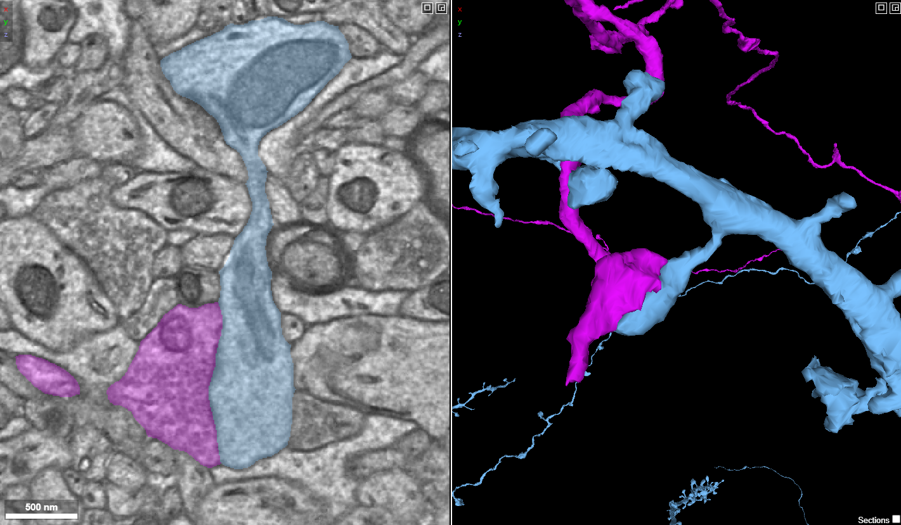
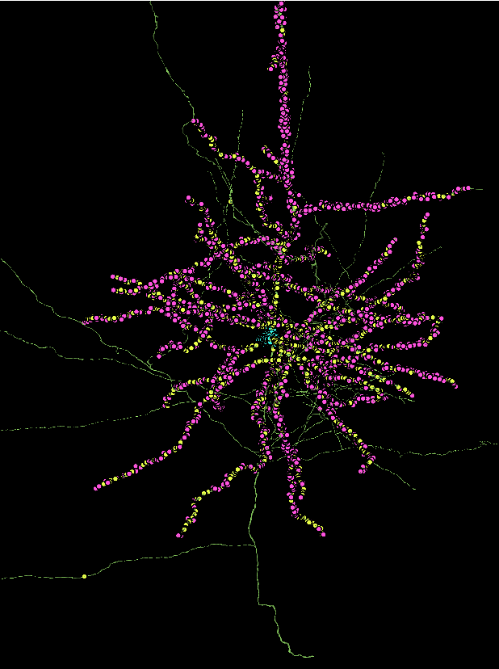
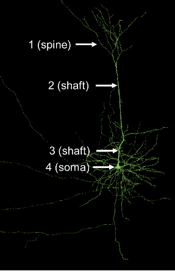
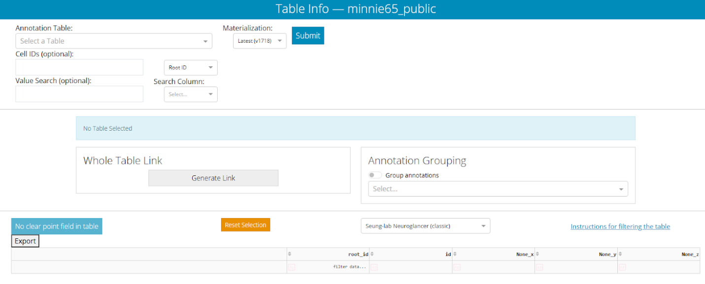
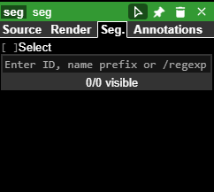
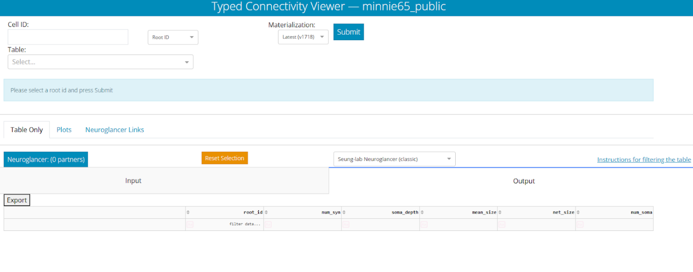
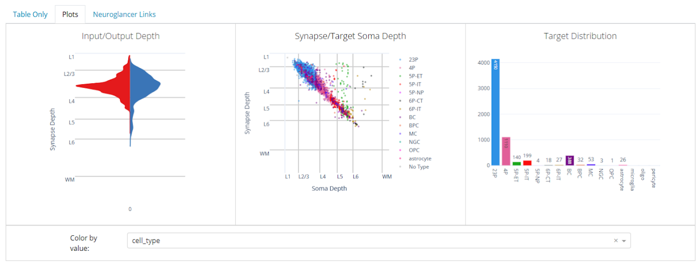

[{fig-align="center"}](https://spelunker.cave-explorer.org/#!gs://microns-static-links/mm3/education/module-3-spines-cover.json)

## Overview

This module moves from single cells to circuits. You will classify **dendritic spines** and synapse locations on a pyramidal neuron, distinguish excitatory from inhibitory inputs, and then use the MICrONS **Dash Apps** to query neurons by cell type and connectivity across the whole dataset. The capstone is a 3D model of chandelier-cell connectivity.

Then you will build some scientific insight on what makes a Chandelier cell unique from other cells.

## Learning goals

* Identify and classify dendritic spine morphologies, and locate spine, shaft, and somatic synapses.
* Distinguish excitatory from inhibitory synapses and reason about their influence on firing.
* Use the **Table Viewer** and **Connectivity Viewer** Dash Apps to search neurons by type and connectivity.
* Compare Basket and Chandelier cells and build a 3D connectivity render.

## Part 1.1 · Dendritic spines and synapse location

Open the spine walkthrough link:

> <https://spelunker.cave-explorer.org/#!gs://microns-static-links/mm3/education/module-3-spine-walkthrough.json>

The view opens on a pyramidal neuron (green): the left panel is EM, the middle is its 3D reconstruction. Navigation controls are the same as Module 1:

* ( rotate
*  pan
* + zoom).

In addition, you can:

*  on an annotation in the 3D or 2D panel to center it
*  on an annotation to open the Details submenu on the right, which tells you more about the type of synapse and its partners

::: {.callout-tip}
## Low-resolution mesh
If you are zoomed out you will notice the mesh is very blocky and it is hard to tell synapses apart. As you zoom in the higher resolution will load. If you have zoomed in a lot and the mesh is still blocky, grab the instructor or TA to help you increase the resolution. The higher resolution has a performance trade-off, is slower to load, and is turned down by default.

:::

### Spine morphology

Zoom into the dendrites and you will see small protrusions — **dendritic spines**, the primary postsynaptic sites of excitatory transmission. They are classified by shape into mushroom, thin, stubby, and filopodial types:

![Four morphological types of dendritic spines. Adapted from [@Pchitskaya_2020].](resources/synapse_shapes_pchitskaya.jpeg){fig-align="center"}

:::{.task}
Zoom into the 3D panel and find a spine resembling each of the four types (mushroom, thin, stubby, filopodial). Note below how confident you were in each call and what shape features you used.
:::



### Excitatory vs. inhibitory

**Excitatory synapses** increase action potential firing probability (often via Na⁺/Ca²⁺ influx).

**Inhibitory synapses** lower it (via Cl⁻ influx or K⁺ efflux). 

In vertebrates the dominant excitatory transmitter is glutamate; the dominant inhibitory transmitters are GABA and glycine. 

:::{.task}
What neurotransmitter does this excitatory pyramidal neuron most likely release from its axon terminals?
:::



:::{.task}
What neurotransmitter does this excitatory pyramidal neuron most likely recieve at synapses on its dendrites?
:::



### Spine, shaft, and somatic synapses

Only **dendrites** carry spines. Some neurons are **aspiny** meaning they have no spines or very few. Synapses onto a neuron occur at three compartments: 

* dendritic **spines** (almost always excitatory, electrically compartmentalized)
* dendritic **shafts** (excitatory or inhibitory)
* the **soma** (often inhibitory, and powerful because it sits closest to the axon hillock).

The information (electric potentials) recieved at each synapse are summed together. If the integrated inputs reach the activation threshold at the **axon hillock**, an **action potential** is generated and sent down the axon.

![A spine synapse (left) and a shaft synapse (right). Adapted from [@Bucher_2019].](resources/spine_shaft_bucher.png){fig-align="center"}

Activate the postsynaptic prediction layer (click the struck-through layer tab). Dots mark synaptic inputs onto this neuron: spine synapses are purple, shaft yellow, somatic cyan.

{fig-align="center"}

:::{.task}
Locate the **axon hillock**.
:::



Consider these four hypothetical synapse sites:

{fig-align="center"}

:::{.task}
Which site (1–4) is closest to the axon hillock?.
:::



:::{.task}
Assume shaft synapses 2 and 3 are inhibitory: would they inhibit the neuron equally, or would one be stronger? Explain.
:::



## Part 1.2 · Cell types with the Table Viewer

The whole dataset can be queried with **Dash Apps**. The **Table Viewer** produces a sortable list of cells by predicted type and metadata. Open it:

> <https://minnie.microns-daf.com/dash/datastack/minnie65_public/apps/table_viewer/?datastack=%22minnie65_public%22>

Select `aibs_metamodel_celltypes_v661` in the **Annotation Table** box and click **Submit**. You get a table of Root IDs with a predicted `cell_type` and `classification_system` for each — cell types predicted from perisomatic EM features by a machine-learning model [@elabbady_perisomatic_2025]. Click a column header to sort.

::: {.callout-tip}
## Cell-type abbreviations you may see
Pyramidal cells are named by layer + "P" (e.g. `23P`, `4P`, `5P-IT`). Inhibitory interneurons include Basket (BC), Bipolar (BPC), Martinotti (MC), Neurogliaform (NGC). Non-neuronal: astrocytes, microglia, oligodendrocytes.
:::

::: {.callout-warning}
## About dataset versions and the yellow version warning 
The Materialization dropdown defaults to **"Latest"**; the module scenes use **v1300**. To get the best match between versions, select Materialization **v1300**. 

A yellow banner when you hit submit just means the app substituted the valid Root ID for the version you queried — that is expected. See the [Setup & FAQ](setup.qmd).
:::

Now open a Neuroglancer window that accepts pasted Root IDs:

> <https://spelunker.cave-explorer.org/#!gs://microns-static-links/mm3/education/module-4-cells-from-table.json>

Copy a Root ID from the Table Viewer ( the cell, then ) and paste it into the "Enter ID…" box in Neuroglancer, then click the eye icon to show it.

:::{.task}
Pick **five Root IDs of different cell types**, view each in Neuroglancer, and record the Root ID, cell type, and a short morphology note (branching, size, spines, synapse distribution). "Share" your state with all 5 roots and add it to your answer below. *If a mesh or synapses fail to load*, just choose a different Root ID.
:::



### Basket vs. Chandelier cells

Basket and Chandelier cells are both **GABAergic interneurons** with dense axon arbors that target near the soma of pyramidal cells. But they differ in one meaningul way. Let's find out how!

![Basket and Chandelier cell targeting. Adapted from [@Fino_2013].](resources/basket_and_chandelier_fino.png){fig-align="center"}

Open the scene with example cells (Root IDs ending 504, 411, 618, 745 are Basket cells; 294, 364, 598 are Chandelier cells, hidden by default — click their eye icons):

> <https://spelunker.cave-explorer.org/#!gs://microns-static-links/mm3/education/module-4-basket-chandelier.json>

:::{.task}
Compare Basket and Chandelier cell morphology. What differences can you find? What is similar?
:::



## Part 1.3 · Connectivity Viewer for Basket and Chandlier outputs

The **Connectivity Viewer** takes a Root ID and returns every neuron it is synaptically connected to, plus summary plots. Open it:

> <https://minnie.microns-daf.com/dash/datastack/minnie65_public/apps/connectivity/?datastack=%22minnie65_public%22>

Paste Root ID `864691136107670745` (a basket cell) into **Cell ID**, then select `aibs_metamodel_celltypes_v661` in the Table box, and Submit. 

Then open the **Plots** tab and set **Color By Value** to `cell_type`. The plots show input/output by cortical depth, each output synapse by depth vs. target soma depth, and the count of target cells by type.

Query any one of these Basket and any one of these Chandelier cells and compare their Plots tabs:

|  Basket cells  |  Chandelier cells  |
| -------------- | ------------------ |
| `864691135101289504` | `864691135293114294` |
| `864691135640484411` | `864691135583296365` |
| `864691135996104618` | `864691137054708598` |

:::{.task}
Describe how Basket and Chandelier cell connectivity differs — look at input/output synapse positions, the relationship between synapse depth and target soma depth, and the types of cells receiving output.
:::



### Scientific Insight · Build a 3D visualization of Chandelier-cell connectivity

:::{.task}
Create a 3D render illustrating a Chandelier cell's connectivity:

1. Open a fresh Neuroglancer window and a fresh Connectivity Viewer.
2. Choose a Chandelier cell Root ID from the table above; show it in Neuroglancer.
3. Query the same Root ID in the Connectivity Viewer (Table = `aibs_metamodel_celltypes_v661`).
4. Pick **top three pyramidal cells** that receive output from it, and add all three to Neuroglancer.
5. Provide the three items below.
:::



Bonus: try ticking the checkboxes for the top 3 pyramidal cells in the connectivity viewer, then clicking the blue "Neuroglancer: (3 partners)" button.

## Additional resources

Explore the dataset further at [MICrONS-Explorer.org](https://www.microns-explorer.org/cortical-mm3).

## Works cited
